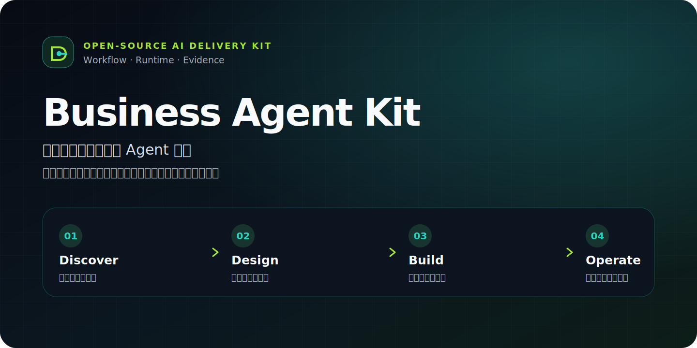
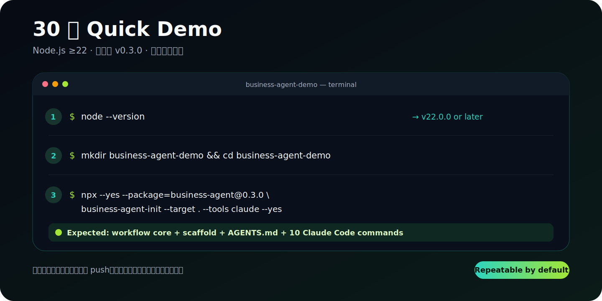
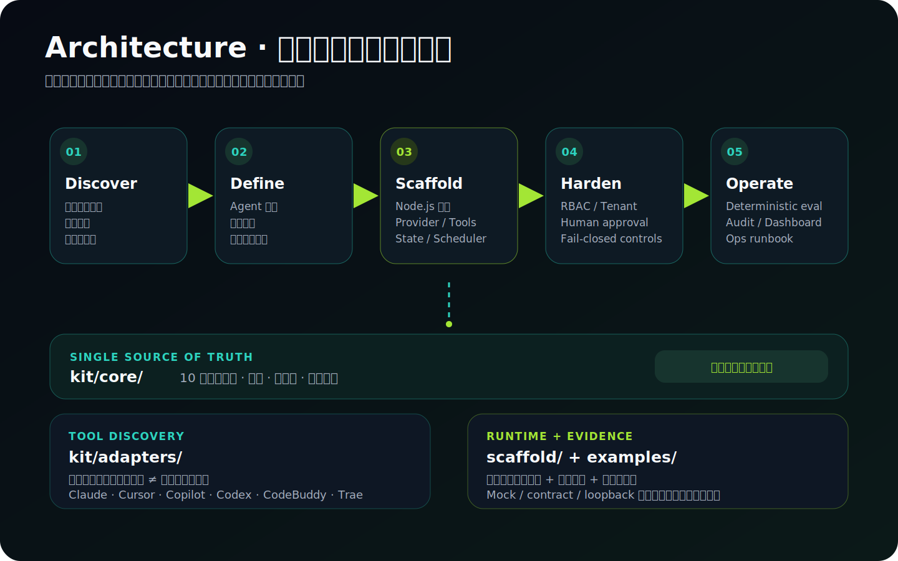

# Business Agent Kit



[](https://github.com/bluecoast1379/business-agent/actions/workflows/check.yml)
[](https://www.npmjs.com/package/business-agent)
[](./package.json)
[](./LICENSE)

**把业务 AI Agent 从发现、设计、实现到安全运营编译成可复验交付。** 10 个阶段命令将业务资产、机会、蓝图、工具契约、安全、评测与运营固化为可检查产物；零依赖 Node.js scaffold 把蓝图落成可运行网关。先回答业务问题，再生成代码。

> **证据边界：** 仓库提供可运行 scaffold，以及 contract、deterministic mock 和 loopback 测试证据；这些证据不等于任何特定客户环境已经通过生产认证。真实部署仍需接入方完成外部身份、存储、HTTPS ingress、provider、渗透与业务验收。

## 三个项目，如何选择

| 项目 | 适合你在解决的问题 | 核心交付 |
| --- | --- | --- |
| **Business Agent Kit（本仓库）** | 把业务 AI Agent 从机会规划推进到可运行网关 | 业务工作流 + runtime scaffold + guardrails / evals |
| [open-workflow-kit](https://github.com/bluecoast1379/open-workflow-kit) | 治理团队在多种 AI Coding 工具中的交付质量 | 完成合同 + 证据账本 + 多工具研发治理 |
| [openone-workflow-kit](https://github.com/bluecoast1379/openone-workflow-kit) | 独立开发者同时推进产品研发与商业化 | 研发 / 增长双轨工作流 + 多工具适配 |

## 30 秒 Quick Demo

以下以已发布的 `business-agent@0.3.0` 为可复现基线；网络下载时间不计入 30 秒。请在准备好的空目录中执行，Node.js 需为 22 或更高版本：

```bash
# 1. 确认运行时
node --version
# 2. 创建演示工作区
mkdir business-agent-demo && cd business-agent-demo
# 3. 生成 Claude Code 入口和共享 workflow core
npx --yes --package=business-agent@0.3.0 business-agent-init --target . --tools claude --yes
```

预期结果：目录中出现根 `AGENTS.md`、`business-agent/core/`、`business-agent/scaffold/` 和 10 个 `.claude/commands/*.md` 入口；初始化器不会 push、部署、写数据库或修改生产配置。完整安装验收见 [docs/install.md](./docs/install.md)。



## 架构一览



架构中的关键事实均可在文本中复验：`kit/core/` 是方法论单一事实源，`kit/adapters/` 只做工具发现，`scaffold/` 提供运行时骨架，`examples/` 提供合成数据样例。详细扩展点见 [scaffold guide](./docs/scaffold-guide.md)。

## 发布边界：`main` / Unreleased 与 `v0.3.0`

| 范围 | 已确认内容 | 不应混淆的边界 |
| --- | --- | --- |
| `v0.3.0` tag / npm 包 | 四工具适配（Claude Code、Cursor、GitHub Copilot、Codex）、production profile、行业模板与发布检查 | Release 证据只覆盖 tag 快照；不含后来加入的 CodeBuddy / Trae |
| 当前 `main` / `Unreleased` | 在 `v0.3.0` 上新增 CodeBuddy / Trae instructions adapter，因此当前矩阵为六工具 | 结构与仓库内检查通过不代表各真实客户端版本已人工认证 |

发布内容以不可变 tag、npm Registry 和 [CHANGELOG](./CHANGELOG.md) 共同核对；`main` 的新能力在下一个版本发布前属于 Unreleased。

## 核心能力

| 能力 | 说明 |
| --- | --- |
| 10 个阶段命令 | 从 `discover-business` 到 `operate-agent`,`kit/core/command-manifest.yaml` 是跨工具入口的单一事实源;`scaffold-gateway` 是进入写代码阶段的唯一实现闸门 |
| 零依赖 production scaffold | Node 22+ ESM,只用 Node 内置模块与全局 `fetch`;自带 Anthropic / OpenAI-compatible / Mock provider、principal RBAC、持久化状态、可靠执行、durable scheduler、隐私默认关闭的 telemetry、只读 dashboard 与确定性 eval |
| 六工具 adapter | Claude Code / Cursor / GitHub Copilot 生成项目级命令入口,CodeBuddy / Trae 生成单文件工具指引,Codex 经根 `AGENTS.md` 栅栏块接入;adapter 只做薄转发,方法论只存在于 `kit/core/` |
| 脱敏检查 | `npm run check:sanitized` 扫描全仓词面与通用密钥形态,支持 `--extra-banned` 挂接仓库外私有 denylist |
| 网关十大事故清单 | 把业务 agent 网关的常见事故(兜底密钥、无鉴权端点、成本追踪未接线、写操作无确认……)沉淀为 `kit/core/checklists/gateway-incidents.md`,`harden-agent` 阶段强制逐项对照 |

## 三层结构

- `kit/core/`:工具无关的方法论内核——10 个命令契约、产物模板、知识库(网关架构 / 工具设计 / 护栏 / 分层诊断 / 巡检 / 成本模型 / 渠道)与事故清单。
- `scaffold/`:运行时骨架——`scaffold-gateway` 命令把它复制为目标工作区的 `agent-gateway/` 并按蓝图定制;骨架本身零依赖、可用 mock provider 直接跑通。
- `kit/adapters/`:多工具入口——每个 adapter 只声明路径与发现方式,执行时统一回读 core 的命令契约。
- `examples/templates/`:retail、customer-support、finance-ops 三套版本化行业 starter pack;每套包含 agent blueprint、工具 policy manifest、workflow、eval dataset 与阈值。

`examples/brewline/` 是对虚构精品咖啡豆 B2B 供应商 Brewline 走完整流程的黄金样例:全部为合成数据,只用于对照产物结构,不是运行时信任源。

## 快速开始

将本仓库 checkout 到目标工作区**之外**,然后在目标工作区根目录运行:

```bash
node ../business-agent/bin/init-workspace.cjs --target . --tools claude,cursor,copilot
```

也可以使用 wrapper:

```bash
../business-agent/install.sh . --tools claude
```

常用参数:

```bash
# 非交互初始化;待补资料写入 business-agent/INITIALIZATION_QUESTIONS.md
node ../business-agent/bin/init-workspace.cjs --target . --tools claude --yes

# 只预览写入/清理/冲突计划,不落盘
node ../business-agent/bin/init-workspace.cjs --target . --dry-run

# 升级已初始化的工作区;business-profile.yaml 永不被原地覆盖
node ../business-agent/bin/init-workspace.cjs --target . --upgrade
```

`--tools` 支持 `claude,cursor,copilot,codex,codebuddy,trae`(默认 `claude`;别名 `trea` 自动归一为 `trae`);传入 `kiro` 等暂不支持的工具会直接报错并指向 [支持矩阵](./docs/support-matrix.md)。生成物清单、升级保护规则与接收方验收清单见 [INIT.md](./INIT.md);tarball / Git / registry 三种安装通道见 [docs/install.md](./docs/install.md)。

## 工作流总览

| 顺序 | 命令 | 标题 | 产出(目标工作区侧) |
| --- | --- | --- | --- |
| 0 | `agent-status` | 规划状态总览 | 无(读态汇报) |
| 1 | `discover-business` | 业务资产盘点 | `agents/_portfolio/00-discovery.md` |
| 2 | `map-opportunities` | Agent 机会矩阵 | `agents/_portfolio/01-opportunity-matrix.md` |
| 3 | `plan-roadmap` | 分波路线图与预算 | `agents/_portfolio/02-roadmap.md` |
| 4 | `design-agent` | 单个 Agent 蓝图 | `agents/<slug>/00-blueprint.md` |
| 5 | `define-tools` | 工具契约目录 | `agents/<slug>/01-tool-contracts.yaml` |
| 6 | `scaffold-gateway` | 实例化网关代码 | `agent-gateway/` |
| 7 | `harden-agent` | 安全加固审查 | `agents/<slug>/02-safety-review.md` |
| 8 | `eval-agent` | 评测与验收 | `agents/<slug>/03-eval-plan.md` |
| 9 | `operate-agent` | 运营与巡检 | `agents/<slug>/04-ops-runbook.md` |

建议路径:`discover-business → map-opportunities → plan-roadmap → design-agent → define-tools → scaffold-gateway → harden-agent → eval-agent → operate-agent`,随时用 `agent-status` 查看每个 agent 的阶段与缺口。`scaffold-gateway` 带实现闸门:蓝图(00)与工具契约(01)必须存在,且蓝图中「未决问题」清空之后才允许生成代码。完整方法论叙事见 [docs/methodology.md](./docs/methodology.md),黄金样例见 [examples/brewline/](./examples/brewline/README.md)。

## scaffold 三分钟体验(mock provider)

不需要任何密钥即可跑通全链路。假设已完成初始化,目标工作区里有 `business-agent/scaffold/` 副本(直接在本仓库的 `scaffold/` 目录体验也一样):

```bash
cd business-agent/scaffold
LLM_PROVIDER=mock GATEWAY_AUTH_TOKEN=development-token PORT=8787 node src/index.js
# stdout 出现 "listening on 8787" 即启动成功
```

另开一个终端:

```bash
# 1) 健康检查(无需鉴权)
curl -s http://127.0.0.1:8787/health

# 2) 无 token 调用会被拒绝(预期 401)
curl -s -i -X POST http://127.0.0.1:8787/chat \
  -H "Content-Type: application/json" \
  -d '{"sessionId":"demo","message":"top customers"}'

# 3) 带 token 对话:mock provider 会先调用 demo 工具再回答
curl -s -X POST http://127.0.0.1:8787/chat \
  -H "Authorization: Bearer development-token" \
  -H "Content-Type: application/json" \
  -d '{"sessionId":"demo","message":"top customers"}'

# 4) 查看会话数与月成本(costUsd > 0 说明成本追踪已接线)
curl -s http://127.0.0.1:8787/status -H "Authorization: Bearer development-token"
```

也可以不起端口,直接用 CLI 交互或跑内置自检:

```bash
LLM_PROVIDER=mock GATEWAY_AUTH_TOKEN=development-token node bin/chat-repl.js
npm run smoke
```

换成真实 provider 时,复制 `.env.example` 为 `.env`,选择 `LLM_PROVIDER=anthropic|openai-compatible` 并注入 `LLM_API_KEY`;缺任何必填项服务会 fail-fast 直接退出,不存在兜底密钥。架构与扩展方式见 [docs/scaffold-guide.md](./docs/scaffold-guide.md)。

## 从开发切换到生产 profile

本地演示默认使用 `RUNTIME_PROFILE=development`、内存 state 与 local scheduler。生产启动至少要求:

```dotenv
RUNTIME_PROFILE=production
LLM_MODEL=<approved-model-id>
LLM_PRICE_TABLE_JSON={"<approved-model-id>":{"inputPerMTok":3,"outputPerMTok":15}}
AUTH_PRINCIPALS_JSON=[...]
STATE_ADAPTER=file
STATE_FILE_PATH=/controlled-volume/business-agent/state.json
SCHEDULER_ADAPTER=durable
TELEMETRY_ENABLED=false
# 非 loopback 监听仅允许位于可信 HTTPS ingress 之后：
TLS_TERMINATED_BY_TRUSTED_PROXY=true
```

`AUTH_PRINCIPALS_JSON` 为每个 Bearer token 绑定 subject、tenant、role 与 scopes;`GATEWAY_AUTH_TOKEN` 仅保留为旧版 admin 迁移入口。内置 file adapter 通过 `wx` 排他锁、checksum、fsync 与原子 rename 支持**同主机多进程**并发与重启恢复(`multiProcess: true`,`multiHost: false`);跨主机/共享网络文件系统部署必须注入通过 conformance tests 的事务/CAS driver。

Telemetry 隐私默认关闭;启用时必须显式配置 OTLP endpoint,且只导出脱敏后的 allowlist 元数据。非 loopback production listener 必须置于可信私网 HTTPS ingress 后；业务 backend、notify、LLM 与 OTLP 外连强制 HTTPS。Dashboard 只接受 GET/HEAD,需要 operator/admin/auditor 与逐页读取 scope,不会执行审批、重试或配置变更。完整配置、RBAC 表、OpenAI-compatible provider、可靠执行、scheduler、eval、状态迁移与回滚步骤见 [docs/production-profile.md](./docs/production-profile.md)。

## 安全与隐私边界

- 仓库不含任何真实业务数据:全部示例基于虚构公司 Brewline 合成,发布前经 `check:sanitized` 词面与密钥形态扫描。
- scaffold 配置 fail-fast:production profile 缺 principal、持久化 state、durable scheduler、模型精确价格或 telemetry endpoint 时直接拒绝启动;任何配置项没有内置可用的默认密钥或默认内部地址。
- 真实 provider 响应限制为 4 MiB，usage 必须是完整的非负安全整数，malformed stop/tool 契约与未知成本结果都 fail closed。
- OpenAPI/MCP 工具结果受 bytes/depth/node 边界限制，driver 原始 error message 不进入 provider transcript；provider 已完成后成本 ledger 写失败会保守消耗整笔 reservation。
- HTTP 端点按 principal role + scope 授权,并按 tenant 做 quota 与会话隔离;工具 policy 缺字段 fail closed。
- 所有写操作工具必须声明 `effect: write`、`approval: human` 与 `idempotency: required`:参数化写操作还必须提供脱敏的审批 projection，返回 args/review digest 与短时效 confirmation id，人工确认后二次调用才真正执行；禁止盲审批。
- 工具经 scope 绑定(如强制注入 `tenant_id`)防越权;后端鉴权永不被网关绕过。
- session、run、confirmation、cost、job、audit、idempotency 与 dead-letter 可共用 durable store；普通 write/workflow/job 异常默认进入 unknown/reconciliation，只有明确已知拒绝才允许重试。HTTP chat 支持、manual job 强制 request `Idempotency-Key`。
- Telemetry 默认 off;HTTP 仅外发模板化 route 与服务端 request id，API/SSE 响应 `no-store`；审计只记录脱敏元数据并维护有界 hash chain，以 chain-head checkpoint O(1) 追加。tool/agent/webhook/scheduler/管理写 effect 先用原子 `started` 事件占用容量，满载时在 effect 前拒绝；scheduler 自动与手动执行共享 guard，预算/配额拒绝与未认证请求不占槽，轮换必须完整归档而不静默删除。
- 初始化器只写本地工作区:不做远程 Git 操作、不部署、不写数据库、不改生产配置。
- 私有值(密钥映射、内部域名、denylist)放目标工作区被 Git 忽略的 `business-agent/local/`,或仓库之外。

完整基线见 [docs/security-baseline.md](./docs/security-baseline.md)。

## 本地验证

```bash
npm run check
```

依次执行以下 gate（完整 Node tests 会自动发现 `scaffold/test/` 与根 `test/` 中的新测试）:

```bash
npm run check:syntax      # bin/test/scaffold 全部 js/cjs/mjs 语法检查
npm run check:sanitized   # 词面 + 密钥形态脱敏扫描
npm run check:manifest    # 命令清单与 commands/ 文件一致性
npm run check:adapters    # adapter contract / schema conformance
npm run check:templates   # 行业模板结构、policy、workflow 与 eval matrix
npm run test:runtime      # runtime / security / adapter / release Node tests
npm run eval              # 固定 mock provider 的确定性阈值 gate
npm run check:scaffold    # scaffold 冒烟:mock provider 起服务并断言鉴权/对话/成本
npm run check:release     # packed artifact allowlist、secret scan 与 SBOM
```

任一失败整体非零退出。`release:verify` 复用同一入口;CI 在受支持 OS/Node matrix 上执行它。kit 与 scaffold 均无 npm 依赖,`node >= 22` 即可运行全部检查。检查不会 push、部署、写生产配置、写生产数据库或 publish。

## 支持矩阵与维护发布

| 工具 | 项目级入口 | 状态 |
| --- | --- | --- |
| Claude Code | `.claude/commands/<id>.md` | generated |
| Cursor | `.cursor/commands/<id>.md` | generated |
| GitHub Copilot | `.github/prompts/<id>.prompt.md` | generated |
| Codex | 无项目级 prompts 文件,经根 `AGENTS.md` 栅栏块 | via-AGENTS.md |
| CodeBuddy | `.codebuddy/instructions.md` 单文件指引 | instructions |
| Trae | `.trae/instructions.md` 单文件指引 | instructions |

`generated` 表示初始化器生成逐命令入口，`instructions` 表示生成单文件工具指引，`via-AGENTS.md` 表示依赖根说明文件；三者均通过仓库内结构检查，但都不等于已在每个真实客户端版本完成人工认证。人工验收口径与六工具完整边界见 [docs/support-matrix.md](./docs/support-matrix.md)。

维护约定:通用规则只改 `kit/core/`,adapter 保持薄入口;贡献三原则与 PR 检查清单见 [CONTRIBUTING.md](./CONTRIBUTING.md);漏洞私密报告与发布前脱敏义务见 [SECURITY.md](./SECURITY.md);行为规范见 [CODE_OF_CONDUCT.md](./CODE_OF_CONDUCT.md)。当前版本 `0.3.0`，对应 git tag `v0.3.0` 与 npm 包 `business-agent@0.3.0`;见 [CHANGELOG.md](./CHANGELOG.md)。License:Apache-2.0。
